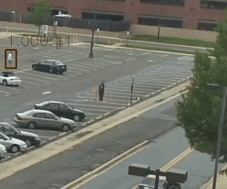

# CMU Object Detection & Tracking for Surveillance Video Activity Detection

This repository contains the code and models for object detection and tracking from the CMU [DIVA](https://www.iarpa.gov/index.php/research-programs/diva) system. Our system (INF & MUDSML) achieves the **best performance** on the ActEv [leaderboard](https://actev.nist.gov/prizechallenge#tab_leaderboard) ([Cached](https://www.cs.cmu.edu/~junweil/resources/actev-prizechallenge-06-2019.png)). 

If you find this code useful in your research then please cite

```
@inproceedings{chen2019minding,
  title={Minding the Gaps in a Video Action Analysis Pipeline},
  author={Chen, Jia and Liu, Jiang and Liang, Junwei and Hu, Ting-Yao and Ke, Wei and Barrios, Wayner and Huang, Dong and Hauptmann, Alexander G},
  booktitle={2019 IEEE Winter Applications of Computer Vision Workshops (WACVW)},
  pages={41--46},
  year={2019},
  organization={IEEE}
}
```


## Introduction
We utilize state-of-the-art object deteciton and tracking algorithm in surveillance videos. Our best object detection model basically uses Faster RCNN with a backbone of Resnet-101 with dilated CNN and FPN. The tracking algo (Deep SORT) uses ROI features from the object detection model.


<div align="center">
  <div style="">
      
      
  </div>
</div>

## Dependencies
The code is originally written for Tensorflow v1.10 with Python 2.7 but it works on v1.13.1, too. Note that I didn't change the code for v1.13.1 instead I just disable Tensorflow warnings and logging. I have also tested this on tf v1.14.0 (ResNext backbone will need >=1.14 for group convolution support).

Other dependencies: numpy; scipy; sklearn; cv2; matplotlib; pycocotools

## Code Overview
- `obj_detect.py`: Inference code for object detection.
- `obj_detect_tracking.py`: Inference code for object detection & tracking.
- `models.py`: Main model definition.
- `nn.py`: Some layer definitions.
- `main.py`: Code I used for training and testing experiments.


## Inferencing
1. First download some test videos and the v3 model (v4-v6 models are un-verified models as we don't have a test set with ground truth):
```
$ wget https://aladdin-eax.inf.cs.cmu.edu/shares/diva_obj_detect_models/models/v1-val_testvideos.tgz
$ tar -zxvf v1-val_testvideos.tgz
$ ls v1-val_testvideos > v1-val_testvideos.lst
$ wget https://aladdin-eax.inf.cs.cmu.edu/shares/diva_obj_detect_models/models/obj_v3_model.tgz
$ tar -zxvf obj_v3_model.tgz
```

2. Run object detection on the test videos
```
$ python obj_detect.py --model_path obj_v3_model --version 3 --video_dir v1-val_testvideos \
--video_lst_file v1-val_testvideos.lst --out_dir test_json_out --frame_gap 1 --visualize \
--vis_path test_vis_out --get_box_feat --box_feat_path test_box_feat_out
```
The object detection output for each frame will be in `test_json_out/` and in COCO format. The visualization frames will be in `test_vis_out/`. The ROI features will be in `test_box_feat_out/`. Remove `--visualize  --vis_path test_vis_out` and `--get_box_feat --box_feat_path test_box_feat_out` if you only want the json files.

3. Run object detection & tracking on the test videos
```
$ python obj_detect_tracking.py --model_path obj_v3_model --version 3 --video_dir v1-val_testvideos \
--video_lst_file v1-val_testvideos.lst --out_dir test_json_out --frame_gap 1 --get_tracking \
--tracking_dir test_track_out
```
The tracking results will be in `test_track_out/` and in MOTChallenge format. To visualize the tracking results:
```
$ ls $PWD/v1-val_testvideos/* > v1-val_testvideos.abs.lst
$ python get_frames_resize.py v1-val_testvideos.abs.lst v1-val_testvideos_frames/ --use_2level
$ cd test_track_out/VIRAT_S_000205_05_001092_001124.mp4
$ ls Person > Person.lst; ls Vehicle > Vehicle.lst
$ python ../../track_to_json.py Vehicle Vehicle.lst Vehicle Vehicle_json
$ python ../../track_to_json.py Person Person.lst Person Person_json
$ python ../../vis_json.py Person.lst ../../v1-val_testvideos_frames/ Person_json/ Person_vis
$ python ../../vis_json.py Vehicle.lst ../../v1-val_testvideos_frames/ Vehicle_json/ Vehicle_vis
$ ffmpeg -framerate 30 -i Vehicle_vis/VIRAT_S_000205_05_001092_001124/VIRAT_S_000205_05_001092_001124_F_%08d.jpg Vehicle_vis_video.mp4
$ ffmpeg -framerate 30 -i Person_vis/VIRAT_S_000205_05_001092_001124/VIRAT_S_000205_05_001092_001124_F_%08d.jpg Person_vis_video.mp4
```
Now you have the tracking visualization videos for both "Person" and "Vehicle" class.

4. You can also run both inferencing with frozen graph (See [this](SPEED.md) for instrctions of how to pack the model). Change `--model_path obj_v3.pb` and add `--is_load_from_pb`. It is about 30% faster.

## Models
These are the models you can use for inferencing. The original ActEv annotations can be downloaded from [here](https://next.cs.cmu.edu/data/actev-v1-drop4-yaml.tgz). I will add instruction for training and testing if requested. Click to download each model.

<table>
  <tr>
  	<td colspan="6">
  		<a href="https://aladdin-eax.inf.cs.cmu.edu/shares/diva_obj_detect_models/models/obj_v2_model.tgz">Object v2</a>
  	: Trained on v1-train</td>
  </tr>
  <tr>
    <td>Eval on v1-val</td>
    <td>Person</td>
    <td>Prop</td>
    <td>Push_Pulled_Object</td>
    <td>Vehicle</td>
    <td>Mean</td>
  </tr>
  <tr>
    <td>AP</td>
    <td>0.831</td>
    <td>0.405</td>
    <td>0.682</td>
    <td>0.982</td>
    <td>0.725</td>
  </tr>
  <tr>
    <td>AR</td>
    <td>0.906</td>
    <td>0.915</td>
    <td>0.899</td>
    <td>0.983</td>
    <td>0.926</td>
  </tr>
</table>

<table>
  <tr>
  	<td colspan="6">
  		<a href="https://aladdin-eax.inf.cs.cmu.edu/shares/diva_obj_detect_models/models/obj_v3_model.tgz">Object v3</a> (<a href="https://aladdin-eax.inf.cs.cmu.edu/shares/diva_obj_detect_models/models/obj_v3.pb">Frozen Graph for tf v1.13</a>)
  	: Trained on v1-train, Dilated CNN</td>
  </tr>
  <tr>
    <td>Eval on v1-val</td>
    <td>Person</td>
    <td>Prop</td>
    <td>Push_Pulled_Object</td>
    <td>Vehicle</td>
    <td>Mean</td>
  </tr>
  <tr>
    <td>AP</td>
    <td>0.836</td>
    <td>0.448</td>
    <td>0.702</td>
    <td>0.984</td>
    <td>0.742</td>
  </tr>
  <tr>
    <td>AR</td>
    <td>0.911</td>
    <td>0.910</td>
    <td>0.895</td>
    <td>0.985</td>
    <td>0.925</td>
  </tr>
</table>

<table>
  <tr>
  	<td colspan="6">
  		<a href="https://aladdin-eax.inf.cs.cmu.edu/shares/diva_obj_detect_models/models/obj_v4_model.tgz">Object v4</a>
  	: Trained on v1-train & v1-val, Dilated CNN, Class-agnostic</td>
  </tr>
  <tr>
    <td>Eval on v1-val</td>
    <td>Person</td>
    <td>Prop</td>
    <td>Push_Pulled_Object</td>
    <td>Vehicle</td>
    <td>Mean</td>
  </tr>
  <tr>
    <td>AP</td>
    <td>0.961</td>
    <td>0.960</td>
    <td>0.971</td>
    <td>0.985</td>
    <td>0.969</td>
  </tr>
  <tr>
    <td>AR</td>
    <td>0.979</td>
    <td>0.984</td>
    <td>0.989</td>
    <td>0.985</td>
    <td>0.984</td>
  </tr>
</table>

<table>
  <tr>
  	<td colspan="6">
  		<a href="https://aladdin-eax.inf.cs.cmu.edu/shares/diva_obj_detect_models/models/obj_v5_model.tgz">Object v5</a>
  	: Trained on v1-train & v1-val, Dilated CNN, Class-agnostic</td>
  </tr>
  <tr>
    <td>Eval on v1-val</td>
    <td>Person</td>
    <td>Prop</td>
    <td>Push_Pulled_Object</td>
    <td>Vehicle</td>
    <td>Mean</td>
  </tr>
  <tr>
    <td>AP</td>
    <td>0.969</td>
    <td>0.981</td>
    <td>0.985</td>
    <td>0.988</td>
    <td>0.981</td>
  </tr>
  <tr>
    <td>AR</td>
    <td>0.983</td>
    <td>0.994</td>
    <td>0.995</td>
    <td>0.989</td>
    <td>0.990</td>
  </tr>
</table>

<table>
  <tr>
  	<td colspan="6">
  		<a href="https://aladdin-eax.inf.cs.cmu.edu/shares/diva_obj_detect_models/models/obj_v6_model.tgz">Object v6</a>
  	: Trained on v1-train & v1-val, Squeeze-Excitation CNN, Class-agnostic</td>
  </tr>
  <tr>
    <td>Eval on v1-val</td>
    <td>Person</td>
    <td>Prop</td>
    <td>Push_Pulled_Object</td>
    <td>Vehicle</td>
    <td>Mean</td>
  </tr>
  <tr>
    <td>AP</td>
    <td>0.973</td>
    <td>0.986</td>
    <td>0.990</td>
    <td>0.987</td>
    <td>0.984</td>
  </tr>
  <tr>
    <td>AR</td>
    <td>0.984</td>
    <td>0.994</td>
    <td>0.996</td>
    <td>0.988</td>
    <td>0.990</td>
  </tr>
</table>

## Other things I have tried
These are my experiences with working on this [surveillance dataset](https://actev.nist.gov/):
1. FPN provides significant improvement over non-FPN backbone;
2. Dilated CNN in backbone also helps but Squeeze-Excitation block is unclear (see model obj_v6);
3. Cascade RCNN doesn't help (IOU=0.5). I'm using IOU=0.5 in my evaluation since the original annotations are not "tight" bounding boxes.
4. Decoupled RCNN (using a separate Resnet-101 for box classification) slightly improves AP (Person: 0.836 -> 0.837) but takes 7x more time.
5. SoftNMS shows mixed results and add 5% more computation time to system (since I used the CPU version). So I don't use it.
6. Tried [Mix-up](https://arxiv.org/abs/1710.09412) by randomly mixing ground truth bounding boxes from different frames. Doesn't improve performance.
7. Focal loss doesn't help.

## Training & Testing
Instruction to train a new model is [here](TRAINING.md).

## Speed Optimization
**TL;DR**:
- TF v1.10 -> v1.13 (CUDA 9 & cuDNN v7.1 -> CUDA 10 & cuDNN v7.4) ~ +9% faster
- Use frozen graph  ~ +30% faster
- Use TensorRT optimized graph ~ +?% faster

Experiments are recorded [here](SPEED.md).

## Acknowledgements
I made this code by studying the nice example in [Tensorpack](https://github.com/tensorpack/tensorpack/tree/master/examples/FasterRCNN).


